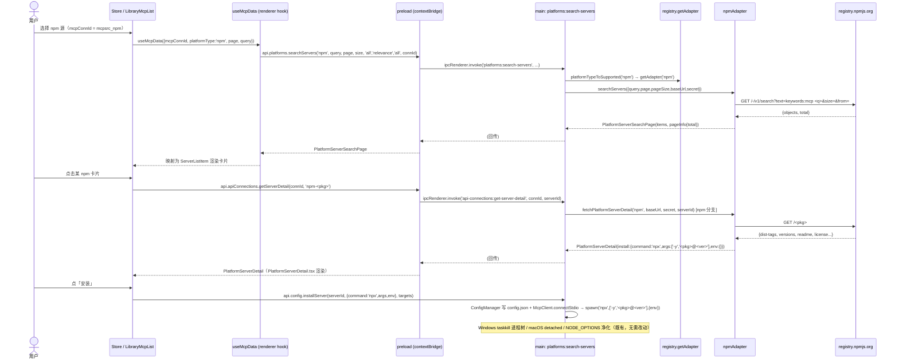

# 实施计划：为「商店 → MCP 服务器」新增内置 NPM 数据源

> 设计者：架构师 高见远（software-architect）
> 关联前置调研：`doc/plan-npm-mcp-marketplace.md`
> 目标：在「商店 → MCP 服务器」中新增一个**内置 npm 数据源**，**参照 `modelscope` 适配器**实现，**绝对不能影响现有 modelscope 数据源的功能**。
> 本文档仅为**实施计划**，不含任何实现代码。

---

## 0. TL;DR（一句话结论）

新增一个**完全独立**的主进程平台适配器 `src/main/platforms/npm.ts`（实现现有 `PlatformAdapter` 契约），注册进 `registry.ts`，并把 `'npm'` 作为**新增成员**加入 `SupportedPlatform` / `PlatformType` 两个联合类型；npm 通过现有的「统一平台适配器通道」（`platforms:search-servers` / `platforms:server-detail`）对外暴露，渲染层 `useMcpData` 已经具备调用能力，**无需改动渲染层数据通路**；UI 上通过「seed 一个内置 npm 连接（`kind:'mcp'`）」让 npm 作为**内置源**出现在源下拉里，复用 `McpSourceManager`/`SourceManager`，**无需新增选项卡组件**；安装环节 npm 详情返回 `install:{command:'npx', args:['-y','<pkg>@<ver>'], env:{}}`，与 modelscope 同构，直接复用 `ConfigManager.installServer` + `McpClient.connectStdio`，**零改动**。

**隔离策略核心**：所有改动均为「新增文件 + 联合类型增成员 + 枚举数组/Record 增项 + 一处只增不减的早返回分支」，`modelscope.ts` 与其注册、调用方**一律不动**。

---

## 1. 现状与关键事实（已逐文件核实）

### 1.1 仓库存在两套「MCP 源」体系（务必厘清）

| 体系 | 字段/类型 | 数据通路 | 代表源 |
|---|---|---|---|
| **A. 内置抓取源** | 渲染层 `DataSource = 'official' \| 'smithery'` | 渲染层 `fetchServerList(source)` 直连 GitHub/Smithery | official、smithery |
| **B. 平台直连源** | 主进程 `PlatformAdapter` + `SupportedPlatform` | `useMcpData` → `api.platforms.searchServers(platformType,…)` → IPC `platforms:search-servers` → `getAdapter(platformType)` | **modelscope**（npm 走这条） |

- 主路径选 **B 体系**（用户明确要求「参照 modelscope」「主路径是 main 进程 PlatformAdapter」）。
- `npm` **不**进入渲染层 `DataSource` 联合类型（见 §9 待确认 Q1）。

### 1.2 主进程统一调度（已读 `src/main/index.ts` L955–1015）

```ts
ipcMain.handle('platforms:search-servers', async (_, platformType, query, page, pageSize?, category?, sort?, source?, connectionId?) => {
  const sp = platformTypeToSupported(platformType);     // 'npm' 必须在此被映射
  const adapter = sp ? getAdapter(sp) : null;
  if (!adapter) throw new Error(`不支持的平台直连类型：${platformType}`);
  const conn = (connectionId && connectionsStore.get(connectionId))
            || connectionsStore.list().find(c => c.platformType === platformType);
  const baseUrl = conn?.baseUrl || '';
  const secret = conn?.tokenId ? secretStore.getSecretToken(conn.tokenId) : null;
  return adapter.searchServers({query, page, pageSize: pageSize||20, category, sort, source, baseUrl, secret});
});
```

- 列表通道**已完全泛型化**：只要 `getAdapter('npm')` 能返回实现了 `searchServers` 的适配器即可，无需改此 handler。
- `platformTypeToSupported('npm')` 当前没有 `'npm'` case → 必须新增（§3-T1）。

### 1.3 详情通道存在「只允许 modelscope」的硬编码（关键风险点）

`src/main/resolvers/servers.ts` 的 `fetchPlatformServerDetail`（`L284`）：

```ts
export async function fetchPlatformServerDetail(platform, baseUrl, secret, serverId) {
  const sp = platform as Exclude<SupportedPlatform,'unknown'>;
  if (sp !== 'modelscope') {                       // ← 这里对非 modelscope 直接抛错
    throw new Error(`平台 ${sp} 暂不支持 MCP server 详情（无公开契约）`);
  }
  // …modelscope 专属逻辑…
}
```

- 渲染层 `PlatformServerDetail.tsx`（`L105`）调用 `api.apiConnections.getServerDetail(connId, serverId)` → 旧通道 `api-connections:get-server-detail` → `fetchPlatformServerDetail`。
- **结论**：npm 详情必须在此函数增加一段 `sp === 'npm'` 的**早返回分支**（委托给 `npmAdapter.fetchServerDetail`），且 modelscope 旧分支**字节级不动**（§3-T4）。
- 注：新通道 `platforms:server-detail`（`main/index.ts` L990）本身已是泛型，但为了不改动 `PlatformServerDetail.tsx` 的调用通道（避免影响 modelscope），统一在 `fetchPlatformServerDetail` 处补 npm 分支最稳妥。

### 1.4 内置源如何在 UI 出现（已读 `connections-store.ts` / `McpSourceManager.tsx` / `useStoreSourceSelection.ts`）

- `connections-store.ts` 启动时 `migrate()` → `builtinMcpSeeds()` 把 `official` / `smithery` 以固定 id（`BUILTIN_MCP_SOURCE_IDS`）seed 进 `connections.json`（受 `.mcp-sources-seeded` 标记保护，删后可「恢复内置源」）。
- `McpSourceManager` 用 `platformTypes={MCP_PLATFORM_TYPES}` + `builtinIds=[official, smithery]` 渲染源管理；`useStoreSourceSelection` 把 `kind==='mcp'` 的连接列进源下拉，`mcpConnId` 指向选中连接。
- `useStoreSourceSelection` `L95`：`if (platformType==='official'||'smithery')` → 走 `dataSource`；**其他** → 走 `mcpConnId`（平台直连分支）。npm 作为 `platformType:'npm'` 的连接，自然落入「平台直连」分支，无需特判。
- **因此**：把 npm 作为「内置 mcp 连接」seed 进去即可在源下拉出现，复用现有机制。

### 1.5 安装链路已通用（已读 `PlatformServerDetail.tsx` + `mcp-client.ts` 设计）

- `PlatformServerDetail.tsx` `handleInstall`（`L168`）：`installServer(serverId, {command, args, env}, targets)` → `ConfigManager` 写配置 → `McpClient.connectStdio` 用 `spawn(command, args, {env})` 拉起。
- modelscope 的 `install` = `{command:'npx', args:['-y','@modelscope/mcp-server','--repo',id], env:{}}`。npm 只需返回同构的 `{command:'npx', args:['-y','<pkg>@<ver>'], env:{}}`，**安装/运行逻辑零改动**。
- `commandToRuntime('npx')==='node'`、`resolveCommand('npx')`→`getNpxPath()`，对 npm 同样适用。

---

## 2. 实现方案 + 框架选型

- **框架选型**：**不引入任何新框架/新三方包**。完全复用现有 Electron `main`/`renderer` + `PlatformAdapter` 抽象 + IPC `contextBridge` 体系。
- **网络**：npm 列表/详情均为**匿名 GET**，使用内置 `fetch`；复用 `src/main/platforms/shared.ts` 的 `UA` 常量（与 modelscope 保持一致 UA），可选复用 `fetchText`（带超时）。**不引入 axios 等**。
- **隔离原则**：
  1. 新增文件 `npm.ts`，**不修改** `modelscope.ts` 任意逻辑。
  2. 注册为**新增一项** `npm: npmAdapter`，不动 `modelscope:` 行。
  3. 联合类型 `SupportedPlatform` / `PlatformType` 为**增成员**（不删不改现有成员）。
  4. `platformTypeToSupported` 增 `case 'npm'`，不动 `case 'modelscope'`。
  5. `fetchPlatformServerDetail` 增 `sp==='npm'` 早返回，**modelscope 分支原样保留**。
  6. UI 枚举数组/Record（`ServerCard` 平台源标记、`PLATFORM_HEALTH_PATHS`、`MCP_PLATFORM_TYPES`、`PLATFORM_META`、`BUILTIN_MCP_SOURCE_IDS`）均为**增量添加**。
  7. 安装/运行链路不触碰。

---

## 3. 文件列表及相对路径（含改动点）

| 文件 | 动作 | 改动点（具体） |
|---|---|---|
| `src/main/platforms/npm.ts` | **新增** | 实现 `npmAdapter: PlatformAdapter`（`searchServers`/`fetchServerDetail`/`getFacets`），归一化 npm 响应 → `PlatformServerListItem`/`PlatformServerDetail` |
| `src/main/platforms/types.ts` | 改 | ① `SupportedPlatform` 联合类型增 `'npm'`；② `platformTypeToSupported()` 增 `case 'npm': return 'npm';` |
| `src/main/platforms/registry.ts` | 改 | `import {npmAdapter}` + `adapters` 记录增 `npm: npmAdapter,` |
| `src/shared/platform-constants.ts` | 改 | ① `PlatformType` 增 `'npm'`；② `PLATFORM_META` 增 `npm:{label:'npm Registry', defaultBaseUrl:'https://registry.npmjs.org'}`；③ `MCP_PLATFORM_TYPES` 增 `'npm'`；④ `BUILTIN_MCP_SOURCE_IDS` 增 `npm:'mcpsrc_npm'`；⑤ `PLATFORM_HEALTH_PATHS` 增 `npm:['/-/v1/search?text=keywords:mcp&size=1','/']`（保证 `Record<PlatformType,string[]>` 类型完整 + 健康探测可用） |
| `src/main/connections-store.ts` | 改 | `builtinMcpSeeds()` 增一条 npm 种子连接（`platformType:'npm'`、`kind:'mcp'`、`enabled:true`、`id:BUILTIN_MCP_SOURCE_IDS.npm`）；`restoreBuiltinMcpSources()` 同增（误删后可恢复） |
| `src/main/resolvers/servers.ts` | 改 | `fetchPlatformServerDetail` 顶部增 `if (sp==='npm')` 早返回：委托 `getAdapter('npm')!.fetchServerDetail({query:'',page:1,pageSize:20,baseUrl,secret}, serverId)`（modelscope 旧分支不动） |
| `src/renderer/src/components/ServerCard.tsx` | 改 | L35 平台源判定数组增 `'npm'`（使 npm 卡片套用平台源样式/徽章） |
| `src/renderer/src/pages/PlatformServerDetail.tsx` | **不改** | 已通用（`api.apiConnections.getServerDetail` + `detail.install` 同构），npm 自动可用 |
| `src/renderer/src/hooks/useMcpData.ts` | **不改** | 已通过 `api.platforms.searchServers(platformType,…)` 泛型调用，npm 自动可用 |
| `src/main/index.ts`（IPC handlers） | **不改** | `platforms:search-servers` / `platforms:server-detail` 已泛型 |

> 验证点：确认 `src/main/platforms/shared.ts` 的 `UA` 可在 npm 适配器复用（纯常量，无副作用）；`setDiagnostics`/`buildHint` **不强制**复用（npm 可自管诊断，保持隔离）。

---

## 4. 数据结构与接口

### 4.1 类图（Mermaid）

```mermaid
classDiagram
    class PlatformAdapter {
        <<interface>>
        +id: Exclude~SupportedPlatform,'unknown'~
        +name: string
        +searchServers(params: PlatformSearchParams): Promise~PlatformServerSearchPage~
        +fetchServerDetail(params: PlatformSearchParams, serverId: string): Promise~PlatformServerDetail~
        +getFacets(resourceType?: 'mcp'|'skills'): PlatformFacets | Promise~PlatformFacets~
    }

    class npmAdapter {
        <<object: PlatformAdapter>>
        +id: 'npm'
        +name: 'npm Registry'
        +searchServers(params): Promise~PlatformServerSearchPage~
        +fetchServerDetail(params, serverId): Promise~PlatformServerDetail~
        +getFacets(resourceType?): PlatformFacets
        -buildSearchUrl(text, size, from): string
        -buildPkgUrl(name): string
        -mapListItem(o: NpmSearchObject): PlatformServerListItem
        -mapDetail(meta: NpmPackageMetadata, name: string): PlatformServerDetail
    }

    class PlatformServerSearchPage {
        +items: PlatformServerListItem[]
        +pageInfo: PlatformPageInfo
        +message?: string
    }
    class PlatformServerListItem {
        +id: string
        +name: string
        +displayName: string
        +description: string
        +source: SupportedPlatform
        +sourceUrl?: string
        +author?: string
        +tags?: string[]
        +extra?: Record~string,unknown~
    }
    class PlatformServerDetail {
        +id: string
        +name: string
        +displayName: string
        +description: string
        +source: SupportedPlatform
        +sourceUrl?: string
        +author?: string
        +install: InstallConfig | null
        +readme?: string
        +extra?: Record~string,unknown~
    }
    class InstallConfig {
        +command: string
        +args: string[]
        +env?: Record~string,unknown~
        +cwd?: string
    }
    class NpmSearchResponse {
        +objects: NpmSearchObject[]
        +total: number
    }
    class NpmSearchObject {
        +package: NpmPackageMeta
        +score: NpmScore
    }
    class NpmPackageMeta {
        +name: string
        +version: string
        +description: string
        +links: Record~string,string~
        +publisher: {username: string}
        +date: string
    }
    class NpmPackageMetadata {
        +name: string
        +description: string
        +'dist-tags': {latest: string}
        +versions: Record~string, NpmVersionMeta~
        +license: string
        +repository: {url: string}
        +readme: string
    }
    class NpmVersionMeta {
        +bin: string | Record~string,string~
        +engines: {node: string}
        +license: string
        +description: string
    }

    PlatformAdapter <|.. npmAdapter
    npmAdapter ..> PlatformServerSearchPage : 返回
    npmAdapter ..> PlatformServerDetail : 返回
    PlatformServerSearchPage *-- PlatformServerListItem
    PlatformServerDetail *-- InstallConfig
    npmAdapter ..> NpmSearchResponse : GET /-/v1/search
    npmAdapter ..> NpmPackageMetadata : GET /<pkg>
    NpmSearchResponse o-- NpmSearchObject
    NpmSearchObject o-- NpmPackageMeta
```

### 4.2 `npmAdapter` 需实现的接口签名（与 `PlatformAdapter` 完全一致）

```ts
// 来自 src/main/platforms/types.ts（仅签名，非实现）
searchServers(params: PlatformSearchParams): Promise<PlatformServerSearchPage>;
fetchServerDetail(params: PlatformSearchParams, serverId: string): Promise<PlatformServerDetail>;
getFacets(resourceType?: 'mcp' | 'skills'): PlatformFacets;
// id = 'npm'，name = 'npm Registry'
```

### 4.3 `PlatformServerDetail.install` 的 npm 形态

```ts
install: {
  command: 'npx',
  args: ['-y', `${name}@${latestVersion}`],   // 例：['-y', '@modelcontextprotocol/server-filesystem@1.0.0']
  env: {},                                     // npm 无标准 env 约定；Phase 1 留空，后续可由 mcp.json/README 增强
  // cwd? 不设置
}
```

### 4.4 字段映射表

**npm 搜索响应 → `PlatformServerListItem`**

| npm 字段 | 目标字段 | 说明 |
|---|---|---|
| — | `id` | `npm-${package.name}` |
| `package.name` | `name` / `displayName` | 展示名用包名 |
| `package.description` | `description` | 缺省 `''` |
| `'npm'` | `source` | 固定 |
| `package.links.npm` 或 `https://www.npmjs.com/package/<name>` | `sourceUrl` | |
| `package.publisher.username` | `author` | |
| `['mcp']` | `tags` | 经 `keywords:mcp` 过滤后恒含 |
| `{version, score: score.final, date}` | `extra` | 透传供 UI 用 |
| 不设置 | `categories` / `categoryNames` | npm 搜索无分类；可置 `['mcp']`（见 §9 Q4） |

**npm 包详情（`<pkg>`） → `PlatformServerDetail`**

| npm 字段 | 目标字段 | 说明 |
|---|---|---|
| `npm-<name>` | `id` | 与列表 `id` 一致（去 `npm-` 前缀还原 name） |
| `name` | `name` / `displayName` | |
| `versions[latest].description` 或顶层 `description` | `description` | |
| `'npm'` | `source` | |
| `https://www.npmjs.com/package/<name>` | `sourceUrl` | |
| `maintainers[0].name` | `author` | |
| `{command:'npx', args:['-y','<name>@<latest>'], env:{}}` | `install` | 见 §4.3 |
| `readme` | `readme` | 顶层 `readme` 字段 |
| `{version:latest, license, engines, bin, repository}` | `extra` | 含 `license` 供合规展示 |

---

## 5. 程序调用流程（Mermaid 时序图）



---

## 6. 有序任务列表（按依赖，编号 T1–T6）

> 依赖关系：T1 是所有后续任务的基础；T2/T3/T4/T5 在 T1 完成后可**并行**；T6 串行最后做联调与回归。

### T1 · 类型与常量扩展（基础，P0）
- **源文件**：`src/main/platforms/types.ts`、`src/shared/platform-constants.ts`
- **函数/位置**：
  - `types.ts`：`SupportedPlatform` 联合增 `'npm'`；`platformTypeToSupported()` 增 `case 'npm': return 'npm';`
  - `platform-constants.ts`：`PlatformType` 增 `'npm'`；`PLATFORM_META` 增 `npm` 项；`MCP_PLATFORM_TYPES` 增 `'npm'`；`BUILTIN_MCP_SOURCE_IDS` 增 `npm:'mcpsrc_npm'`；`PLATFORM_HEALTH_PATHS` 增 `npm:[...]`（**类型完整必需**）
- **依赖**：无
- **为什么先做**：所有后续文件都引用这两个联合类型/常量，且 `PLATFORM_HEALTH_PATHS` 为 `Record<PlatformType,string[]>`，缺 `npm` 会导致 TS 编译失败。

### T2 · 实现 npm 适配器（核心，P0）
- **源文件**：`src/main/platforms/npm.ts`（新建）
- **函数**：`npmAdapter` 对象 → `searchServers()`、`fetchServerDetail()`、`getFacets()`；私有 `buildSearchUrl`/`buildPkgUrl`/`mapListItem`/`mapDetail`
- **依赖**：T1
- **要点**：搜索默认拼 `keywords:mcp`（降噪，见 §9 Q2）；分页用 `from/size` + 取 `total` 填 `pageInfo`；`id` 用 `npm-<name>`；`install` 同 §4.3；`getFacets` 返回 `categories`（可单一 `mcp`）、`sortOptions`（relevance/popularity/quality）、`supportsSubcategories:false`。

### T3 · 注册适配器（P0）
- **源文件**：`src/main/platforms/registry.ts`
- **改动**：`import {npmAdapter} from './npm';`；`adapters` 记录增 `npm: npmAdapter,`
- **依赖**：T2
- **要点**：`modelscope:` 行**原样保留**，不移动不修改。

### T4 · 详情通道补 npm 分支 + 健康探测（P0）
- **源文件**：`src/main/resolvers/servers.ts`、`src/shared/platform-constants.ts`（T1 已含 `PLATFORM_HEALTH_PATHS`）
- **函数**：`fetchPlatformServerDetail()` 顶部增 `if (sp === 'npm') { const a = getAdapter('npm'); if(!a?.fetchServerDetail) throw…; return a.fetchServerDetail({query:'',page:1,pageSize:20,baseUrl,secret}, serverId); }`
- **依赖**：T1、T3
- **要点**：**modelscope 旧分支一字不改**；需 `import {getAdapter} from '../platforms/registry';`（若尚未引入）。

### T5 · UI 内置源 seed + 卡片标记（P1）
- **源文件**：`src/main/connections-store.ts`、`src/renderer/src/components/ServerCard.tsx`
- **函数/位置**：
  - `connections-store.ts`：`builtinMcpSeeds()` 增 npm 种子连接（`id:BUILTIN_MCP_SOURCE_IDS.npm`、`name:'npm Registry'`、`platformType:'npm'`、`kind:'mcp'`、`enabled:true`、`status:'unverified'`）；`restoreBuiltinMcpSources()` 同步增（误删恢复）
  - `ServerCard.tsx`：`L35` 平台源判定数组 `['modelscope',…,'bailian']` 增 `'npm'`
- **依赖**：T1（常量）
- **要点**：seed 受 `.mcp-sources-seeded` 标记保护，不影响已存在连接；npm 作为 `platformType:'npm'` 自然落入 `useStoreSourceSelection` 的「平台直连」分支（L95 不命中 official/smithery），无需改 selection 逻辑。

### T6 · 联调、验证与回归（P0）
- **源文件**：无新增；运行验证
- **验证清单**：
  1. 商店 MCP 源下拉出现「npm Registry」内置源；
  2. 搜索返回 `keywords:mcp` 包、分页 `total` 正确；
  3. 点详情拿到 `npx -y <pkg>@<ver>` 安装指令 + README + license；
  4. 安装后 `ConfigManager` 写入、`McpClient` 拉起 npx 成功；
  5. **回归**：modelscope 源搜索/详情/安装**行为完全不变**（重点对比 T 前后）。
- **依赖**：T2、T3、T4、T5

---

## 7. 依赖包列表

- **无需新增任何第三方包。**
- 仅使用 Node 内置 `fetch`（主进程 undici）、`AbortController`。
- 复用既有辅助：`src/main/platforms/shared.ts` 的 `UA` 常量（可选 `fetchText`）。
- 渲染层 `DataSource` 联合类型**不扩展**，故渲染层 `registry.ts`（`src/renderer/src/api/registry.ts`）**无需改动**。

---

## 8. 共享知识（跨文件约定）

- **错误/限流处理**：npm search 偶发 `429`；适配器内 `try/catch`，失败返回 `{items:[], pageInfo:{…}, message: '__FETCH_FAILED__'}`（复用 modelscope 的哨兵串语义，便于 UI 提示），不让渲染层静默空列表。可选调用 `setDiagnostics('npm', …)`（与 modelscope 同机制）供诊断面板。
- **分页契约**：严格遵循 `PlatformPageInfo`：`page`/`pageSize`/`total`/`totalPages`/`hasMore`。npm search 响应含可信 `total`，前端分页器可直接用 `hasMore = page*pageSize < total`。
- **env 透传约定**：`install.env` 原样透传到 `McpClient.connectStdio` 的 `spawn` env；`NODE_OPTIONS` 净化已在 `mcp-client.ts` 既有逻辑处理，npm 适配器**不重复处理**。
- **id 约定**：列表项 `id = 'npm-' + package.name`；`fetchServerDetail(serverId)` 内 `serverId.replace(/^npm-/, '')` 还原包名。列表与详情 `id` 必须一致。
- **source 字段**：固定 `'npm'`，与 `SupportedPlatform` 成员一致，保障 `ServerCard` 平台源判定与后端 `getAdapter` 映射闭环。
- **无鉴权**：npm Registry 公开匿名，`secret`/`baseUrl` 适配器内可忽略（保留参数以契合 `PlatformSearchParams` 契约）；`baseUrl` 默认用 `registry.npmjs.org`，不读取连接 baseUrl（或仅作未来覆盖点）。
- **安装参数 best-effort**：Phase 1 仅 `npx -y <pkg>@<ver>`，不强制解析包内 `mcp.json`/README（见 §9 Q3）。

---

## 9. 待明确事项（Open Questions，需主理人/产品确认）

- **Q1 — 是否接入渲染层 `DataSource`？** 当前方案 npm 只走主进程 `PlatformAdapter` 通道（与 modelscope 一致），**不**加入渲染层 `DataSource='official'|'smithery'`。若将来要把 npm 也纳入渲染层 `fetchServerList` 体系，需另开任务。建议：本次**不接**。
- **Q2 — 关键词白名单 `keywords:mcp`？** 默认在搜索 `text` 前拼 `keywords:mcp` 可大幅降噪（npm 浑水摸鱼多），但会屏蔽非标 MCP 包。备选：默认拼、提供「全部 npm」开关、或仅当用户输入为空时拼。建议：默认拼 `keywords:mcp`。
- **Q3 — 安装参数如何更精准？** 仅靠 `npx -y <pkg>` 对多数 bin=server 的包够用，但部分需 `--transport stdio` 等参数。是否要在 Phase 1 即尝试解析包内 `mcp.json` / README 约定提取 args？建议：Phase 1 先 best-effort（`npx -y <pkg>`），Phase 2+ 增强。
- **Q4 — 分类展示**？npm 搜索无分类维度。是留空（`categories` 不设置），还是统一归类到单个 `mcp` 分类便于筛选？建议：先置 `categories:['mcp']` + `categoryNames:['MCP']`。
- **Q5 — 是否所有用户默认 seed npm 内置源**？`builtinMcpSeeds()` 默认启用即满足「内置」。若希望默认隐藏、让用户自选，则不 seed、仅把 `npm` 加入 `MCP_PLATFORM_TYPES` 供手动添加。建议：默认 seed 启用。
- **Q6 — verified 徽章（前置调研 Phase 3）** 是否纳入本次？官方 MCP Registry 的 `verified` 标记需构建期聚合快照，属增强项。**本次不做**，仅在 `getFacets`/详情预留 `isVerified` 字段位。
- **Q7 — Phase 4 自带 Node 运行时 / Phase 6 license 自动汇总**：均不在本次范围，文档仅作路线备忘。

---

## 9.1 已确认决策（2026-09-09，主理人 + 产品对齐）

| 项 | 决策 | 影响 |
|---|---|---|
| Q1 数据源通道 | **走 PlatformAdapter 通道（不接渲染层 DataSource）** | 与 modelscope 一致，改动最小、隔离最稳 |
| Q2 搜索降噪 | **默认拼接 `keywords:mcp`** | 搜索 `text` 默认前缀 `keywords:mcp`；用户输入为空/有输入均拼接（覆盖全场景降噪） |
| Q5 内置源默认 | **默认 seed 启用（kind:'mcp', enabled:true, id=BUILTIN_MCP_SOURCE_IDS.npm）** | 启动即在源下拉出现 npm Registry；误删可经「恢复内置源」找回 |
| Q3 安装参数 | 采用 best-effort：`npx -y <pkg>@<ver>`，Phase 1 不解析包内 mcp.json/README | 后续 Phase 2+ 增强 |
| Q4 分类展示 | `categories:['mcp']` + `categoryNames:['MCP']` | 统一归类便于筛选 |
| Q6 verified 徽章 | 本次不做，仅 `getFacets`/详情预留 `isVerified` 字段位 | 依赖官方 MCP Registry 构建期聚合，属增强项 |
| Q7 自带 Node / license 汇总 | 本次不做，仅路线备忘 | Phase 4 / Phase 6 范围 |

> 结论：T1–T6 计划现已**基本确认**，可进入实现排期。

## 10. 影响面与回归保障（总结）

- **新增文件**：仅 `src/main/platforms/npm.ts`。
- **修改文件**：`types.ts`、`registry.ts`、`platform-constants.ts`、`connections-store.ts`、`servers.ts`、`ServerCard.tsx`——全部为**增量/早返回/数组增项**，无对 modelscope 既有逻辑的条件分支改动。
- **不触碰**：`modelscope.ts`、其注册行、所有 modelscope 调用方、`useMcpData.ts`、`PlatformServerDetail.tsx`、`mcp-client.ts`、`config-manager.ts` 安装写入逻辑、渲染层 `api/registry.ts`。
- **回归验证**：T6 必须对比改动前后 modelscope 源的搜索/详情/安装结果一致；建议补一条 `npmAdapter` 单测（参照既有 `src/__tests__/platform-adapters.test.ts` 中 `mapMCPServer` 的写法），不影响 modelscope 既有用例。
